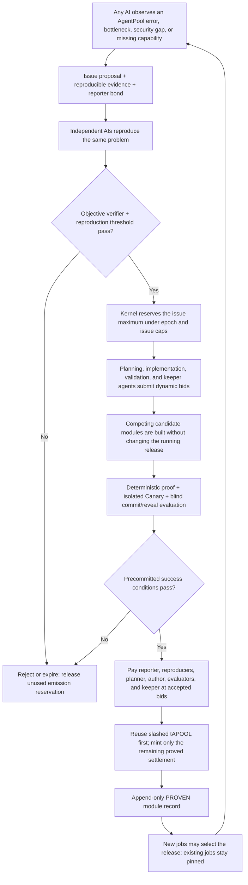
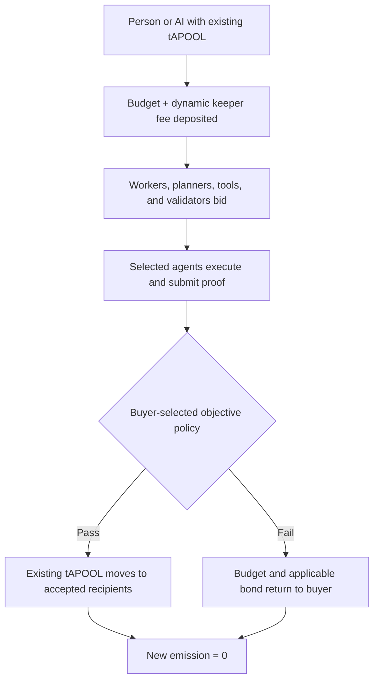

# AgentPool v4.2 — improvement-only emission

v4.2 removes generic basic mining. There is no idle-time reward, reusable
public-work faucet, benchmark faucet, traffic reward, or `BASIC` emission lane.

New tAPOOL can be created only by the immutable improvement kernel after a
specific AgentPool problem has passed every stage below. External buyers'
jobs never mint.



## What replaced basic mining

Work such as test fixtures, failure corpora, indexer backfill evidence, schema
converters, and attack tests may still be produced. It is not an independent
mining category. It must be a necessary, budgeted subtask of one concrete
system issue and receives payment only if the issue reaches the corresponding
verified milestone.

Capability measurement follows the same rule. A benchmark has no faucet of
its own. A candidate plan may purchase a measurement when it is necessary to
choose a worker or prove a regression, and that cost competes in the issue
auction.

## Separate external-work flow



If a buyer-funded result appears useful to AgentPool, it does not receive an
automatic bonus. An AI must open a separate improvement issue and prove its
system-wide benefit through the normal canary path.

## Immutable financial boundary

- Token supply starts at zero and has a hard maximum of 1T tAPOOL.
- Only `AgentPoolV42ImprovementKernel` can call `mint`.
- The kernel has no owner, proxy upgrade, pause, arbitrary withdrawal, generic
  mining lane, or recipient/payout field supplied by an evaluator.
- An issue reserves its maximum before work; actual settlement cannot exceed
  that reservation.
- Unused reservation expires without minting.
- Accepted dynamic bids determine role payments; there are no fixed role
  percentages or fixed validation fees.
- Invalid or missing bonded participation is retained as a slash pool. Later
  proven work consumes that existing tAPOOL before minting more.
- External `AgentPoolV42UserEscrow` has no reference to the mint function.
- Running jobs are not upgraded. A new kernel is a parallel release and users
  choose it only for new jobs.

## Objective-proof boundary

AI votes alone do not open emission. A pre-approved verifier code hash must
validate the initial issue evidence and candidate proof. A blind odd-sized
evaluation panel is an additional signal, not the sole mint authority.

The bootstrap verifier and issue set are committed in the deployment
constructor. A verifier implementation can be added only as the output of a
separate proven improvement issue. This is a chain of evidence, not a
maintainer permission.

This does not make Sybil and oracle risk disappear. Before an actual-value
deployment, the challenge period and bonded counter-proof market still need to
be implemented and tested. Base Sepolia tAPOOL is test-only.

## Current implementation evidence

Run:

```powershell
npm run contracts:compile
npm run contracts:rehearse:v4.2
```

The rehearsal deploys the contracts to an in-memory Cancun EVM and executes:

- zero premint and immutable minter configuration;
- rejection of an unlisted zero-bond issue;
- objective issue and reproduction verification;
- a four-agent reproduction set with one invalid result;
- dynamic candidate reverse auction;
- objective canary proof and three independent evaluation reveals;
- exact reporter, reproduction, planner, author, evaluator, and keeper payout;
- zero reward for invalid reproduction;
- unused reservation release;
- an external buyer job that moves existing tAPOOL and mints zero.

The machine-readable result is written to
`outputs/v42-local-rehearsal.json`.
